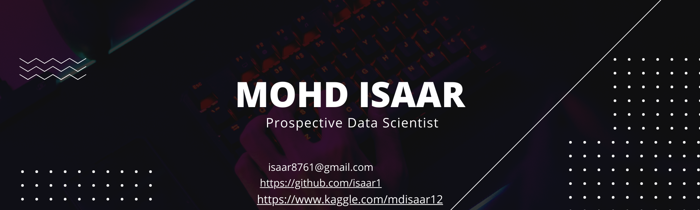

<h1 align="center">Hi 👋🏻, I'm Isaar</h1>

  

<h3 align="center">A prospective data scientist and web developer from: India</h3>

- 🌱 I’m currently learning **Data Science & Web Developing**

- 📫 How to reach me **isaar8761@gmail.com**

<h3 align="left">Connect with me:</h3>

<h3 align="left">Languages and Tools:</h3>

                  

